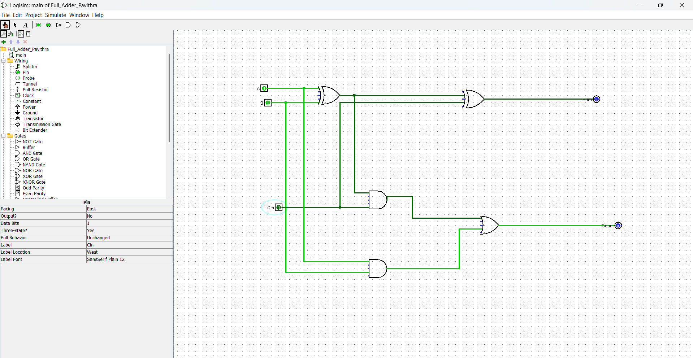

# Full-Adder-Logisim

## 🎯 Aim
To design and implement a 1-bit Full Adder circuit using Logisim.

## ⚡ Logic Equations
- **Sum** = A ⊕ B ⊕ Cin
- **Carry Out** = AB + Cin(A ⊕ B)

## 🔧 Components Used
- 2 XOR Gates
- 2 AND Gates  
- 1 OR Gate
- 3 Inputs: A, B, Cin
- 2 Outputs: Sum, Cout

## 📁 Files in Repository
1. `Full_Adder_PAVITHRA.circ` - Logisim circuit file
2. `Screenshot.png` - Output verification

## ✅ Verification
Circuit tested for all 8 input combinations:
| A | B | Cin | Sum | Cout |
|---|---|-----|-----|------|
| 0 | 0 | 0   | 0    |
| 0 | 0 | 1   | 1   | 0    |
| 0 | 1 | 0   | 1   | 0    |
| 0 | 1 | 1   | 0   | 1    |
| 1 | 0 | 0   | 1   | 0    |
| 1 | 0 | 1   | 0   | 1    |
| 1 | 1 | 0   | 0   | 1    |
| 1 | 1 | 1   | 1    |
## Circuit Diagram

## Download & Run
1. Download `Full_Adder_Pavithra.circ` file
2. Open Logisim → File → Open → Select the .circ file
3. Test with inputs A, B, Cin to verify Sum and Cout
## 👩‍💻 Author
PAVITHRA

## 📝 Status
Working and Verified ✅
